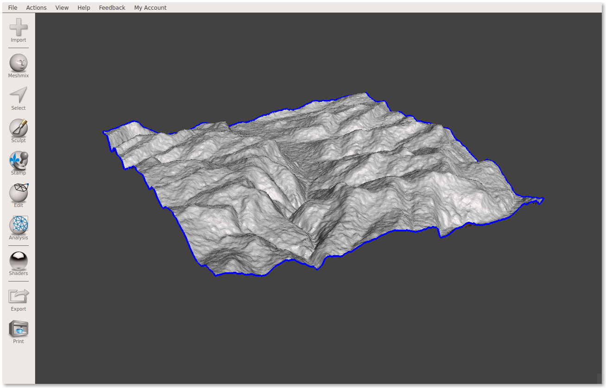
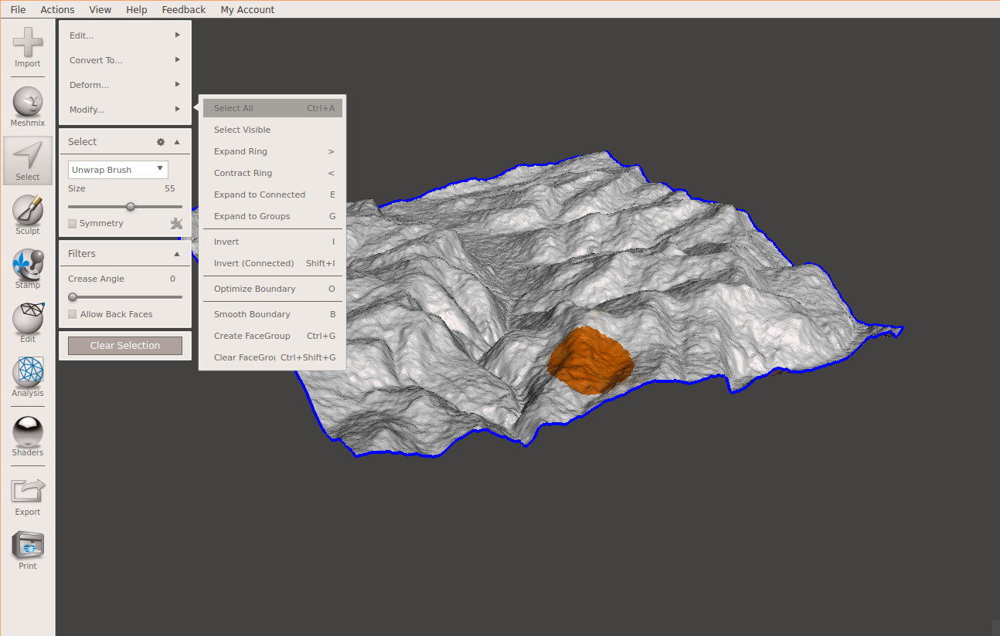
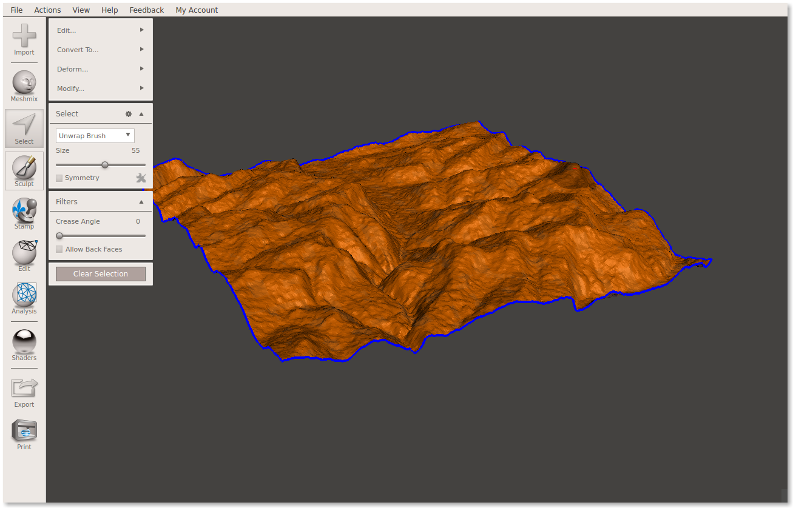
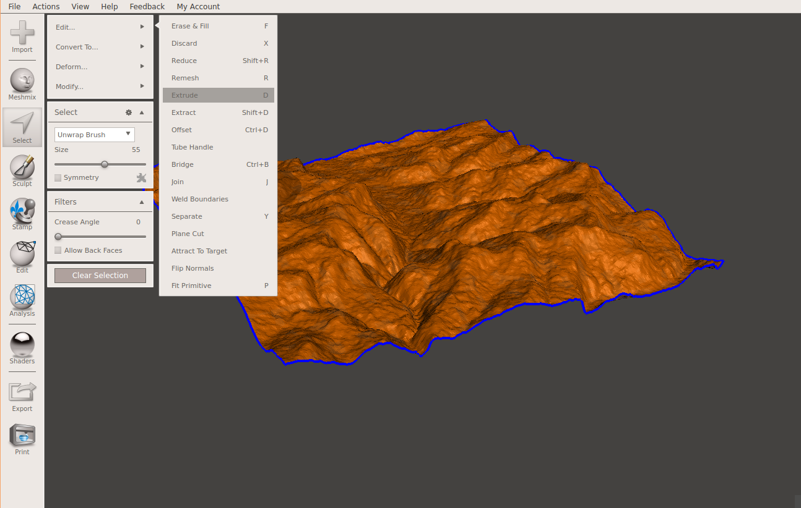
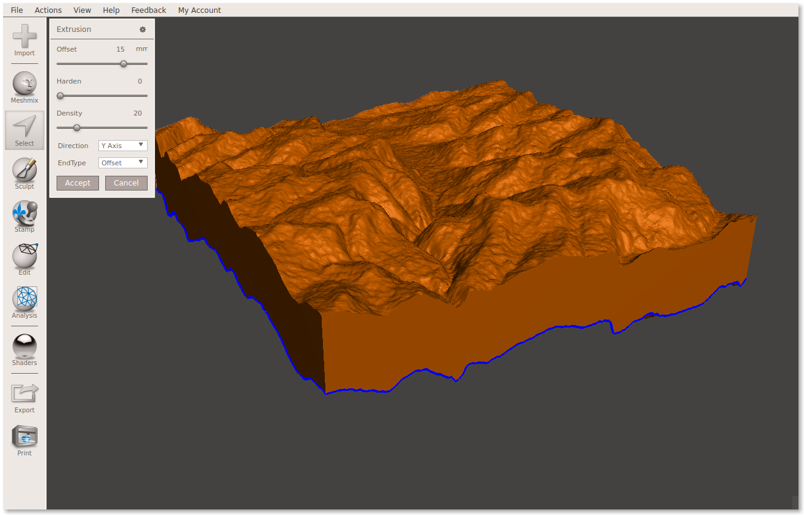
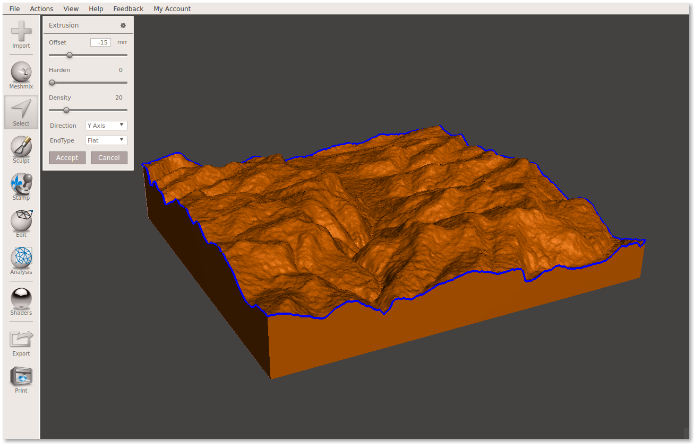

# Extrude a Surface with Meshmixer

How to use Meshmixer's `Select` and `Extrude` tool to solidify a surface mesh created with `phstl`:

1. 
   Open Meshmixer and import [surface.stl](surface.stl)

2. 
   Select the `Select` tool and make an interactive selection on the surface. Then choose `Select All` from the `Modify` selection submenu.
   
   

3. 
   Next choose `Extrude` from the `Edit` selection submenu.

4. 
   Set the offset to a value like `15` mm and set the extrusion `Direction` to `Y Axis` to ensure uniform extrusion.

5. Click `Accept` and export the extruded solid.

# Extrude a Surface with a Flat Base

Follow the same steps as above, but set the extrusion `EndType` to `Flat`. You may want to specify a negative `Offset` (eg, `-15`) to position the flat base correctly.
